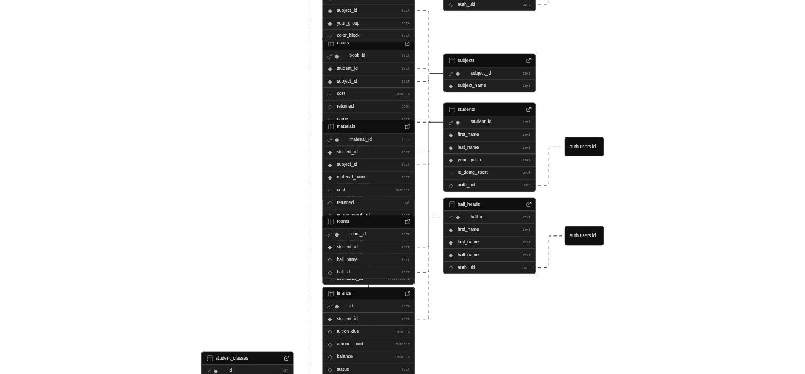

# 🎓 Eclari - Student Clearance Management System

> A comprehensive web-based clearance tracking system built for African Leadership Academy to streamline the end-of-term clearance process for students, teachers, and administrative staff.

[](https://www.python.org/)
[](https://flask.palletsprojects.com/)
[](https://supabase.com/)
[](LICENSE)

---

## 📖 About

Eclari (from "Electronic" + "Clearance") is a modern student clearance portal that digitizes and simplifies the traditionally paper-based clearance process. Students can track their clearance progress across multiple departments (Academic, Finance, Residential, Lab, Sports), while staff members can efficiently manage validations and approvals.

### ✨ Key Features

- **📊 Real-time Clearance Tracking** - Students see live progress across all clearance categories
- **📸 Y1 Photo Verification** - Year 1 students upload photo proof; staff approve remotely
- **👥 Role-based Dashboards** - Custom interfaces for students, teachers, finance, hall, lab, and coaching staff
- **📄 PDF Certificate Generation** - Automated clearance certificates with secure validation
- **🔐 Secure Authentication** - Supabase-powered auth with JWT tokens and RLS policies
- **📱 Responsive Design** - Works seamlessly on desktop, tablet, and mobile devices
- **⚡ Fast & Modern** - Built with Flask + Vite for optimal performance

---

## 🏗️ System Architecture

### Tech Stack

| Layer | Technology | Purpose |
|-------|-----------|---------|
| **Backend** | Flask 3.x (Python) | API server, routing, authentication |
| **Database** | Supabase (PostgreSQL) | User data, clearance records, RLS policies |
| **Auth** | Supabase Auth | JWT-based authentication |
| **Frontend** | Vanilla JS + Vite | Modern ES6 modules, fast bundling |
| **Styling** | Custom CSS | Responsive design system |
| **PDF Generation** | ReportLab | Secure clearance certificates |

### Database Schema

The system uses 12 main tables:
- `students`, `teachers`, `hall_heads`, `finance_staff`, `lab_staff`, `coaches` - User roles
- `classes`, `subjects` - Academic structure
- `books`, `materials` - Resource tracking with approval workflow
- `finance` - Financial clearance records
- `rooms` - Hall assignments and residential clearance



**📚 Detailed documentation:**
- [Project Structure](./PROJECT_STRUCTURE.md) - Complete codebase organization guide
- [Development Guide](./docs/DEVELOPMENT.md) - Step-by-step development instructions
- [API Documentation](./docs/API.md) - All endpoints and database functions
- [Database Schema](./docs/DATABASE_SCHEMA.md) - Full table structure and relationships

See [DATABASE_SCHEMA.md](DATABASE_SCHEMA.md) for complete schema documentation.

---

## 🚀 Quick Start

### Prerequisites

- **Python 3.8+** (recommended: 3.13)
- **Node.js 16+** (for frontend bundling)
- **Supabase account** (free tier works great!)
- **Git** (for version control)

### Installation

**1. Clone the repository**
```bash
git clone https://github.com/Noobigirl/Eclari.git
cd Eclari
```

**2. Set up Python environment**
```bash
# Create virtual environment
python -m venv .venv

# Activate it
source .venv/bin/activate  # Linux/Mac
# OR
.venv\Scripts\activate  # Windows

# Install dependencies
pip install -r requirements.txt
```

> **⚠️ Important:** The project uses `supabase==2.11.0` (stable version). Do **not** upgrade to 2.20.0+ as it has breaking changes that cause deployment failures. See [RENDER_FIX.md](./RENDER_FIX.md) if you encounter import errors.

**3. Set up Node.js dependencies**
```bash
npm install
npm run build
```

**4. Configure environment variables**
```bash
cp .env.example .env
# Edit .env with your Supabase credentials
```

Your `.env` should look like:
```env
FLASK_SECRET_KEY=your-super-secret-key-change-this
SUPABASE_URL=https://your-project.supabase.co
SUPABASE_KEY=your-service-role-key
SUPABASE_ANON_KEY=your-anon-public-key
PDF_OWNER_PASSWORD=optional-pdf-protection-password
```

**5. Set up Supabase database**
- Create a new project at [supabase.com](https://supabase.com)
- Run the migration SQL from `database_migration_year_groups_SAFE.sql`
- Apply RLS policies from `rls_policies_*.sql` files
- Create storage bucket: `clearance-proofs` (for photo uploads)

**6. Run the application**
```bash
# Make sure venv is activated
flask run

# Or for production (with gunicorn)
gunicorn app:app
```

Visit [http://localhost:5000](http://localhost:5000) 🎉

---

## 🎯 User Roles & Workflows

### 👨‍🎓 Students

**What they see:**
- Overall clearance percentage across all categories
- Subject-by-subject breakdown with progress bars
- Books and materials to return
- Financial balance and payment status
- Hall clearance status

**What they can do:**
- **Y1 students**: Upload photos of returned books for teacher approval
- **Y2 students**: Return items physically; teachers mark as returned
- Track real-time clearance progress
- Export PDF certificate when 100% cleared

### 👨‍🏫 Teachers

**What they see:**
- Classes they teach with student rosters
- Pending Y1 photo approvals with thumbnails
- Books assigned to students per subject
- Clearance status for their students

**What they can do:**
- Review uploaded photos of books
- Approve or reject with feedback
- Mark Y2 books as returned (physical verification)
- Filter by class, year group, and status

### 💰 Finance Staff

**What they see:**
- All student financial records
- Total tuition, payments, and balances
- Payment status (Paid, Partial, Outstanding)

**What they can do:**
- Update payment amounts and balances
- Mark accounts as cleared
- Search students by name or ID
- Generate financial clearance reports

### 🏠 Hall Heads

**What they see:**
- Students assigned to their hall
- Room assignments and occupancy
- Hall clearance status per student
- Room inspection status

**What they can do:**
- Mark rooms as inspected and cleared
- Update hall clearance status
- Track residential clearance progress
- Manage room assignments

### 🔬 Lab Staff & 🏃 Coaches

**What they see:**
- Materials/equipment assigned to students
- Pending photo approval requests (Y1)
- Return status for all items

**What they can do:**
- Approve/reject photo proof submissions
- Mark equipment as returned
- Track lab/sports equipment clearance

---

## 📁 Project Structure

```
Eclari/
├── 📄 app.py                          # Main Flask application
├── 📄 supabase_client.py              # Supabase database functions
├── 📄 requirements.txt                # Python dependencies
├── 📄 package.json                    # Node.js dependencies
├── 📄 vite.config.js                  # Vite bundler configuration
│
├── 📁 src/                            # JavaScript source files
│   ├── auth.js                        # Supabase authentication logic
│   └── app.js                         # Main frontend app logic
│
├── 📁 templates/                      # Flask Jinja2 templates
│   ├── index.html                     # Landing page
│   ├── login.html                     # Login page
│   ├── student.html                   # Student dashboard
│   ├── teacher.html                   # Teacher dashboard
│   ├── finance.html                   # Finance dashboard
│   ├── hall.html                      # Hall head dashboard
│   ├── materials_dashboard.html       # Lab/Coach shared dashboard
│   └── subject.html                   # Subject detail page
│
├── 📁 static/                         # Static assets
│   ├── css/styles.css                 # Main stylesheet
│   ├── images/                        # UI images
│   └── js/                            # Built JavaScript bundles
│
├── 📁 sql/                            # Database files
│   ├── database_migration_year_groups_SAFE.sql
│   ├── rls_policies_books.sql
│   ├── rls_policies_materials.sql
│   └── rls_policies_storage.sql
│
└── 📁 docs/                           # Documentation
    ├── DATABASE_SCHEMA.md
    ├── IMPLEMENTATION_COMPLETE.md
    ├── UPLOAD_FIX_COMPLETE.md
    └── PDF_EXPORT_FIX.md
```

---

## 🔌 API Endpoints

### Public Routes
- `GET /` - Landing page
- `GET /login` - Login page

### Protected Routes (Require Authentication)
- `GET /dashboard/<role>` - Role-specific dashboard
- `GET /subject/<subject_id>` - Subject detail page
- `GET /logout` - Logout and clear session

### API Endpoints
- `POST /api/upload-proof` - Y1 students upload photo evidence
- `POST /api/approve-item` - Staff approve/reject photo submissions
- `GET /api/pending-approvals` - Fetch items awaiting approval
- `GET /api/generate-clearance-pdf/<student_id>` - Generate PDF certificate
- `POST /api/update/book/<book_id>/return` - Toggle book return status
- `POST /api/update/material/<material_id>/return` - Toggle material return status
- `POST /api/update/financial/<student_id>` - Update financial record

---

## 🔒 Security Features

- **JWT Authentication** - Secure token-based auth with Supabase
- **Role-Based Access Control** - Users only see data they're authorized for
- **Row Level Security** - Database policies enforce data isolation
- **Session Management** - Secure cookie handling with httpOnly flags
- **CSRF Protection** - Flask secret key for session security
- **Input Validation** - Server-side validation on all endpoints
- **File Upload Security** - Size limits, type validation, isolated storage

---

## 🧪 Testing

### Run Clearance Debug Script
```bash
python test_clearance_debug.py
```

This shows:
- Student clearance calculation breakdown
- Books and materials status
- Financial clearance check
- Reasons why PDF export might fail

### Manual Testing Checklist
- [ ] Login as each role type
- [ ] Upload photo as Y1 student
- [ ] Approve photo as teacher
- [ ] Mark Y2 book as returned
- [ ] Update financial record
- [ ] Export PDF certificate
- [ ] Test responsive design on mobile

---

## 🐛 Troubleshooting

### Common Issues

**"No module named 'reportlab'"**
```bash
pip install reportlab
# Then restart Flask
```

**"Storage bucket 'clearance-proofs' does not exist"**
- Go to Supabase Storage
- Create bucket named `clearance-proofs`
- Make it public
- Apply RLS policies from `rls_policies_storage.sql`

**"Cannot export PDF - only X% complete"**
- Check `test_clearance_debug.py` output
- Verify all books/materials marked as returned or approved
- Ensure financial balance is $0.00

**Photo upload fails**
- Check file size (max 5MB)
- Verify file type (JPEG, PNG, HEIC only)
- Ensure book ID exists in database
- Check Supabase Storage permissions

---

## 📝 Development Notes

### Year Group Workflows

**Year 1 (Y1) Students:**
- Upload photos of books/materials
- Teachers approve remotely
- Faster, paperless process

**Year 2 (Y2) Students:**
- Return items physically
- Teachers verify and mark as returned
- Traditional workflow

### Clearance Calculation

Overall clearance = (cleared_items / total_items) × 100%

**Items counted:**
- All books assigned to student
- All materials (lab + sports)
- Financial status (1 item worth 25% if has debt)

**Cleared when:**
- Y1: `approval_status = 'approved'` OR `returned = true`
- Y2: `returned = true`
- Financial: `tuition_due = 0`

---

## 🚢 Deployment

### Deploy to Render

The easiest way to deploy Eclari is using [Render](https://render.com/):

1. **Push your code to GitHub**
   ```bash
   git add .
   git commit -m "Ready for deployment"
   git push origin main
   ```

2. **Create a new Web Service on Render**
   - Go to [Render Dashboard](https://dashboard.render.com/)
   - Click "New +" → "Web Service"
   - Connect your GitHub repository
   - Render will auto-detect the `render.yaml` configuration

3. **Set Environment Variables**
   In the Render dashboard, add these environment variables:
   - `SUPABASE_URL` - Your Supabase project URL
   - `SUPABASE_KEY` - Your Supabase service role key
   - `SUPABASE_ANON_KEY` - Your Supabase anonymous key
   - `FLASK_SECRET_KEY` - A random secret key (generate with `python -c "import secrets; print(secrets.token_hex(32))"`)
   - `PDF_OWNER_PASSWORD` - Password for PDF encryption

4. **Deploy!**
   - Click "Create Web Service"
   - Render will automatically build and deploy your app
   - Your app will be live at `https://your-app-name.onrender.com`

### Manual Deployment

If deploying to another platform:

```bash
# Install dependencies
pip install -r requirements.txt
npm install && npm run build

# Run with gunicorn (production server)
gunicorn --bind 0.0.0.0:8000 --workers 4 app:app
```

**Important files for deployment:**
- `requirements.txt` - Python dependencies
- `runtime.txt` - Python version specification
- `render.yaml` - Render configuration (optional)
- `.env.example` - Template for environment variables

---

## 🤝 Contributing

While this is a school project, contributions and suggestions are welcome!

1. Fork the repository
2. Create a feature branch (`git checkout -b feature/amazing-feature`)
3. Commit your changes (`git commit -m 'Add amazing feature'`)
4. Push to the branch (`git push origin feature/amazing-feature`)
5. Open a Pull Request

---

## 📜 License

This project is licensed under the MIT License - see the [LICENSE](LICENSE) file for details.

---

## 🙏 Acknowledgments

- **African Leadership Academy** - For the opportunity to solve real-world problems
- **Supabase** - For the amazing backend-as-a-service platform
- **Flask Community** - For the robust web framework
- **ReportLab** - For PDF generation capabilities

---

## 📧 Contact

**Main Developer:** Noobigirl  
**GitHub:** [@Noobigirl](https://github.com/Noobigirl)  
**Project Link:** [https://github.com/Noobigirl/Eclari](https://github.com/Noobigirl/Eclari)

---

<div align="center">
Made with ❤️ for ALA Students
</div>
